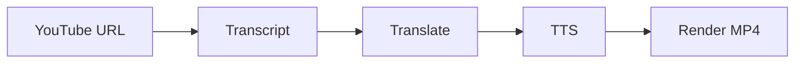

# BRT003 — Pipeline architecture

Related: [002-brt-user-requirements](./002-brt-user-requirements.md) · [004-brt-tech-stack-evaluation](./004-brt-tech-stack-evaluation.md)

## Task Requirement

- Goal: ออกแบบ pipeline มาตรฐาน EN→TH dubbing สำหรับ YouTube
- In scope: แต่ละ stage, data format ระหว่าง stage, error handling ระดับสูง
- Out of scope: เลือก vendor สุดท้าย (BRT004), coding

## Proposed pipeline (จาก web research)

```
YouTube URL
    │
    ▼
[1] Acquire transcript
    │  • มี caption: youtube-transcript-api / TranscriptAPI / Supadata
    │  • ไม่มี caption: yt-dlp audio → Whisper ASR
    ▼
[2] Segment & timestamp
    │  • รักษา offset + duration ต่อ chunk (max ~10s ตาม dub pipelines)
    ▼
[3] Translate EN → TH
    │  • LLM (Gemini/GPT) หรือ NLLB local
    │  • optional: LLM polish สำหรับภาษาไทยธรรมชาติ
    ▼
[4] TTS per segment
    │  • Edge-TTS (th-TH-KanyaNeural) — ฟรี, stable
    │  • Gemini TTS (th-TH GA) — คุณภาพสูง, มี style control
    ▼
[5] Audio assembly
    │  • วาง clip ตาม timestamp
    │  • optional: duck/mix กับ BGM เดิม (Demucs แยก vocal)
    ▼
[6] Video render
    │  • yt-dlp ดาวน์โหลด video
    │  • FFmpeg mux: video + dubbed audio (+ optional SRT burn-in)
    ▼
Output MP4 (+ SRT/VTT)
```

## Reference projects

| Project | จุดเด่น | ลิงก์ |
|---------|---------|-------|
| youtube-auto-dub | Whisper → Google Translate → Edge-TTS → FFmpeg | [GitHub](https://github.com/mangodxd/youtube-auto-dub) |
| OpenDub | Local-first, multi-lang, SpeechT5/OpenAudio | [GitHub](https://github.com/fbscarel/opendub) |
| U-transkript | Transcript + Gemini translate (50+ langs) | [GitHub](https://github.com/U-C4N/U-transkript) |
| yt-transcriber | Whisper + NLLB + Ollama refine | [GitHub](https://github.com/biyachuev/yt-transcriber) |

## Checklist

- [ ] T001 [N] ยืนยัน pipeline stages กับผู้ใช้ (เพิ่ม/ตัด stage)
- [ ] T002 [N] กำหนด **intermediate data format** (JSON segments schema)
- [ ] T003 [N] ตัดสินใจ **caption-only vs Whisper fallback** สำหรับ Phase 1
- [ ] T004 [N] ตัดสินใจ **dub mode**: replace audio vs overlay vs both
- [ ] T005 [N] ระบุ **caching strategy** (transcript, translation, TTS clips)
- [ ] T006 [N] วาด diagram สุดท้าย (mermaid) ใน section ด้านล่าง

## Architecture diagram (กรอกหลังยืนยัน)


