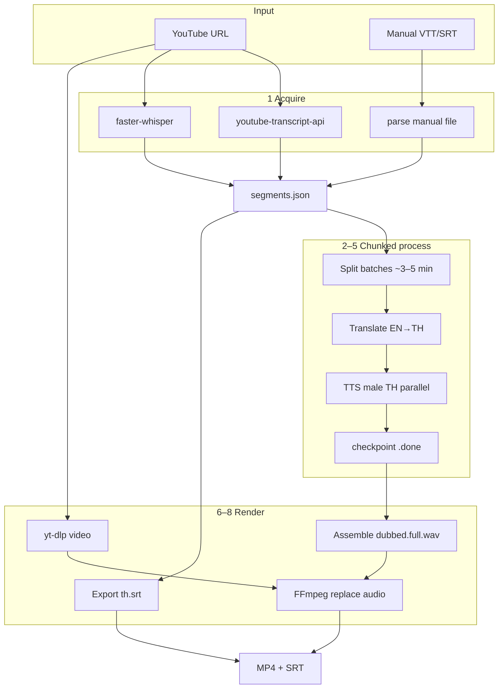

# BRT003 — Pipeline architecture

Related: [002-brt-user-requirements](./002-brt-user-requirements.md) · [004-brt-tech-stack-evaluation](./004-brt-tech-stack-evaluation.md)

## Task Requirement

- Goal: ออกแบบ pipeline มาตรฐาน EN→TH dubbing สำหรับ YouTube
- In scope: แต่ละ stage, data format ระหว่าง stage, long-video strategy, error handling
- Out of scope: implementation code

## Pipeline overview (confirmed)

```
YouTube URL (+ optional --transcript file)
    │
    ▼
[1] Acquire transcript ── auto API │ Whisper │ manual VTT/SRT/txt
    │
    ▼
[2] Normalize → segments.json (timestamped)
    │
    ▼
[3] Split into processing batches (~3–5 min each)
    │
    ▼
[4] Per batch: Translate EN→TH (Gemini │ NLLB local)
    │
    ▼
[5] Per segment: TTS male TH (Gemini │ Edge NiwatNeural)
    │              parallel workers + checkpoint per batch
    ▼
[6] Assemble dubbed audio track (FFmpeg concat / amix timeline)
    │
    ▼
[7] Download video once (yt-dlp) — ทำคู่ขนานได้หลัง batch 1
    │
    ▼
[8] Render: replace audio + export th.srt / th.vtt
    │
    ▼
Output: {video_id}_th.mp4 + {video_id}_th.srt
```

## Transcript acquisition (3 paths)

| Path | เมื่อใช้ | คำสั่ง (draft) |
|------|----------|----------------|
| **A — Auto** | มี YouTube caption | default ใน `dub` |
| **B — Whisper** | ไม่มี caption | `--transcribe whisper` |
| **C — Manual** | clipper/API ล้มเหลว | `dub --transcript clip.vtt --url …` |

Manual import รองรับไฟล์จาก **Obsidian Web Clipper** (VTT/SRT/plain text) — parser แปลงเป็น `segments.json` มาตรฐาน

## Long-video strategy {#long-video-strategy}

วิดีโอ real-world **>30 นาที** — ไม่จำกัดความยาวด้วย hard cap แต่ใช้ **chunked pipeline + resume**

### ปัญหา

| ปัญหา | สาเหตุ |
|-------|--------|
| API timeout / rate limit | Gemini translate/TTS เรียกทีละมาก |
| TTS quality drift | [Gemini TTS แนะนำ chunk <2 นาที](https://ai.google.dev/gemini-api/docs/speech-generation) |
| RAM / disk | โหลดวิดีโอยาวทั้งก้อน |
| ล้มกลางทาง | ต้องไม่เริ่มใหม่ทั้ง pipeline |

### วิธีแก้ (Phase 1)

1. **Work directory ต่อวิดีโอ** — `.trns-agents/{video_id}/`
2. **Batch แบ่งตามเวลา** — รวม segments เป็น batch ~3–5 นาที (~30–60 segments)
3. **Checkpoint ต่อ batch** — ไฟล์ `batches/{n}/.done` + artifacts แยก stage
4. **`--resume`** — ข้าม batch ที่ `.done` แล้ว
5. **Parallel TTS** — worker pool (4–8) ต่อ batch ใน cloud mode
6. **Audio assembly ทีเดียวท้าย pipeline** — FFmpeg `concat` / timeline placement จาก timestamps
7. **Download video แยก** — yt-dlp รันคู่ขนานหลัง transcript พร้อม (ไม่ block TTS)
8. **Whisper ยาว** — `faster-whisper` + VAD บนไฟล์ audio ที่ extract แล้ว; optional แบ่ง audio ทีละ 30 นาที

### Work dir layout

```
.trns-agents/{video_id}/
├── meta.json              # url, mode, voice, started_at
├── source.mp4             # yt-dlp (optional early)
├── source.en.srt          # transcript EN (reference)
├── segments.raw.json      # หลัง acquire
├── segments.json          # normalized
├── batches/
│   ├── 000/
│   │   ├── .done
│   │   ├── translated.json
│   │   └── tts/000.wav …
│   └── 001/ …
├── dubbed.full.wav        # assembled track
├── output.th.srt
└── output.th.mp4
```

## Intermediate data format

```json
{
  "video_id": "QbjAQFJJyt0",
  "segments": [
    {
      "id": "s00042",
      "start_ms": 125000,
      "end_ms": 128500,
      "text_en": "…",
      "text_th": "…",
      "batch_id": 2,
      "tts_wav": "batches/002/tts/s00042.wav",
      "status": "done"
    }
  ]
}
```

## Dual backend

| Stage | cloud (`--mode cloud`) | local (`--mode local`) |
|-------|--------------------------|-------------------------|
| Translate | Gemini 2.5 Flash | NLLB-200 + optional Ollama polish |
| TTS | Gemini TTS male (Charon/Iapetus) | Edge-TTS `th-TH-NiwatNeural` |
| Transcript | youtube-transcript-api | same + faster-whisper |

## Dub mode

**Replace audio** — FFmpeg:

```bash
ffmpeg -i source.mp4 -i dubbed.full.wav -c:v copy -c:a aac -map 0:v -map 1:a -shortest output.th.mp4
```

Subtitle ไทย: สร้าง `output.th.srt` จาก `text_th` + timestamps (ไม่ burn-in Phase 1 default)

## Caching strategy

| Artifact | Cache key | Resume |
|----------|-----------|--------|
| `segments.raw.json` | video_id + transcript source | ข้าม acquire |
| `translated.json` | batch_id + mode + model | ข้าม translate |
| `tts/*.wav` | segment id + voice + text hash | ข้าม TTS |
| `dubbed.full.wav` | all batches done | ข้าม assemble |
| `output.th.mp4` | final | ข้าม render |

CLI: `trns-agents dub <url> --mode cloud|local --resume`

## Architecture diagram



## Checklist

- [x] T001 [N] ยืนยัน pipeline stages กับผู้ใช้
  - ✅ 8 stages + 3 transcript paths
- [x] T002 [N] กำหนด **intermediate data format**
  - ✅ segments.json schema ด้านบน
- [x] T003 [N] caption / Whisper / manual import
  - ✅ 3 paths: auto, Whisper, Obsidian clipper file
- [x] T004 [N] dub mode
  - ✅ replace audio + SRT/VTT export
- [x] T005 [N] **caching / resume** strategy
  - ✅ work dir + batch checkpoint + `--resume`
- [x] T006 [N] diagram สุดท้าย
  - ✅ mermaid ด้านบน
