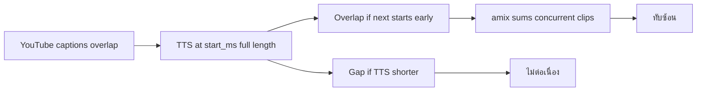

# 008 — Dub audio continuity & overlap fix

Related: [README](../README.md) · [006 POC archive](./archive/2026-06-11/006-poc-implementation-scaffold.md) · [`src/trns_agents/render/audio.py`](../src/trns_agents/render/audio.py)

## Task Requirement

- Goal: แก้ `output.th.mp4` ให้เสียงพากย์ไทย **ต่อเนื่อง** และ **ไม่ทับซ้อน**
- In scope: วิเคราะห์ root cause, ปรับ `assemble_dubbed_audio`, (ถ้าจำเป็น) ปรับ TTS time-fit, remux ทดสอบ `QbjAQFJJyt0`
- Out of scope: เปลี่ยนโมเดลแปล, speaker diarization, cloud TTS
- Test video: `QbjAQFJJyt0` — `.trns-agents/QbjAQFJJyt0/`

## การวิเคราะห์ (root cause)

### อาการที่ผู้ใช้รายงาน

1. **เสียงไม่ต่อเนื่อง** — ช่วงเงียบระหว่างประโยค
2. **เสียงทับซ้อน** — ได้ยินหลายประโยคพร้อมกัน

### สาเหตุที่ 1 — YouTube caption timing ทับซ้อนกัน

วัดจาก `segments.json` (1126 segments):

| เมตริก | ค่า |
|--------|-----|
| Caption window ทับกัน (`end_ms > next.start_ms`) | **1124 / 1125** คู่ |
| ช่องว่างระหว่าง caption (median) | **-1760 ms** (ทับ ~1.8 วินาที) |

YouTube auto-caption มักให้ window ยาวและซ้อนกัน — **ไม่ใช่ช่วงพูดแยบยลย์**

### สาเหตุที่ 2 — วาง TTS ที่ `start_ms` เต็มความยาวไฟล์

[`audio.py`](../src/trns_agents/render/audio.py) ใช้ `adelay=start_ms` แล้วเล่น TTS ทั้งไฟล์ **ไม่ trim / ไม่ยืดหดให้พอดี slot**

ผลลัพธ์ (สุ่ม 100 segments):

| เมตริก | ค่า |
|--------|-----|
| TTS สั้นกว่า slot >500ms → **ช่วงเงียบ** | ~72% |
| TTS ลากยาวเกิน `next.start_ms` → **ทับประโยคถัดไป** | ~90% |

ตัวอย่าง: `s00000` — slot 3120ms, TTS 2640ms แต่ประโยคถัดไปเริ่มเร็วกว่า → **ทับ 1080ms**

### สาเหตุที่ 3 — `amix` รวมเสียงที่ทับเวลากัน

เมื่อหลาย segment ใน chunk (40 ตัว) มีช่วงเวลาทับกัน `amix` **บวกเสียงพร้อมกัน** (`normalize=0`) → ได้ยินหลายเสียงซ้อน

Chunked mix แก้ปัญหา command-line ยาว แต่ไม่แก้ปัญหา timeline

### สรุป causal chain



## แนวทางแก้ (เสนอ)

### แนะนำ: Timeline placement แบบ sequential (Priority A)

แทน `amix` ทุก clip พร้อมกัน:

1. เรียง segment ตาม `start_ms`
2. คำนวณ **ช่วงเล่น** ต่อ segment:
   - `play_at = max(start_ms, prev_end_ms + gap_ms)` *หรือ* `start_ms` ถ้าต้องการ sync กับวิดีโอ
   - `slot_end = min(end_ms, next.start_ms)` เพื่อไม่ล้ำประโยคถัดไป
   - `slot_ms = slot_end - play_at`
3. **Time-fit TTS** ให้พอดี slot:
   - `atempo` (จำกัด เช่น 0.85–1.4) ถ้า TTS ยาวเกิน
   - ปล่อยสั้นกว่า slot ได้ (เงียบ) หรือ optional pad เบาๆ
4. วาง clip ลง timeline ทีละตัว (ffmpeg `adelay` + overlay แบบไม่ sum ซ้อน หรือสร้าง WAV ด้วย numpy/pydub)

### ทางเลือก B — Preprocess captions

- รวม/แยก segment ที่ window ทับกันก่อนแปล+TTS
- งานใหญ่กว่า; กระทบ SRT ทั้ง pipeline

### ทางเลือก C — Strict sync กับวิดีโอ

- บังคับ `play_at = start_ms` + `atempo`/`trim` ให้จบที่ `end_ms`
- ยังทับกันถ้า caption overlap — ต้อง clip ที่ `next.start_ms`

**แนะนำเริ่มที่ A + time-fit (atempo/trim)** ใน `render/audio.py`; ไม่ต้อง re-TTS ถ้าใช้ ffmpeg ตอน assemble

## Checklist

- [x] T001 [N] ออกแบบ algorithm timeline + time-fit (doc ใน PR / comment ใน `audio.py`)
  - ✅ sequential placement + slot ที่ `next.start_ms` ใน `render/audio.py`
- [x] T002 [N] แทนที่ `amix` ด้วย sequential placement ใน [`render/audio.py`](../src/trns_agents/render/audio.py); รองรับ assemble เฉพาะ batch 0 เมื่อ `--max-batches 1` (smoke)
  - ✅ `pipeline.py` ส่ง `assemble_segs` ตาม `max_batches`
- [x] T003 [N] เพิ่ม ffmpeg `atempo`/`atrim` ให้ TTS พอดี slot (env `TRNS_TTS_MIN_TEMPO` / `TRNS_TTS_MAX_TEMPO`)
  - ✅ `_fit_clip` + env defaults 0.85–1.4
- [x] T004 [N] Smoke test batch 0 (`--max-batches 1`) แล้ว remux; ผ่านแล้วค่อย assemble ทั้งเรื่อง (ไม่ re-translate/TTS)
  - ✅ smoke ~5:03 MP4; full remux ~34 min; `timeline_audio_overlaps: 0`
- [x] T005 [U] อัปเดต [README](../README.md) — ข้อจำกัด timing + วิธีทดสอบ
- [x] T006 [N] สคริปต์วิเคราะห์ overlap (optional) สำหรับ regression
  - ✅ `scripts/analyze_dub_timing.py`

## เกณฑ์ยอมรับ

**Smoke (batch 0, ~5 นาที)**

- ฟัง `output.th.mp4` ช่วงแรก — ไม่มีเสียง 2+ เสียงพูดพร้อมกันชัดเจน
- ช่วงเงียบระหว่างประโยคสั้นลงหรือยอมรับได้

**เต็มเรื่อง (หลัง smoke ผ่าน)**

- remux ทั้ง 1126 segments; สุ่มฟังกลางเรื่องด้วย

- ไม่ต้อง re-run batch 0–6 ยกเว้นเลือกปรับ TTS ใหม่

## คำสั่งทดสอบหลังแก้

```powershell
cd E:\SRC\ai\my\trns-agents
.venv\Scripts\activate

# 1) Smoke — batch 0 เท่านั้น (~5 นาที, ไม่ re-translate/TTS ถ้า batch 0 done แล้ว)
trns-agents dub "https://www.youtube.com/watch?v=QbjAQFJJyt0" --mode local --resume --max-batches 1

# 2) หลัง smoke ผ่าน — assemble + remux ทั้งเรื่อง
trns-agents dub "https://www.youtube.com/watch?v=QbjAQFJJyt0" --mode local --resume
```

หมายเหตุ: ปัจจุบัน `--max-batches` จำกัดแค่ translate/TTS — T002 ต้องส่งต่อให้ assemble/mux เฉพาะ segments ใน batch ที่ประมวลผล (smoke = batch 0, ~5 นาที)
