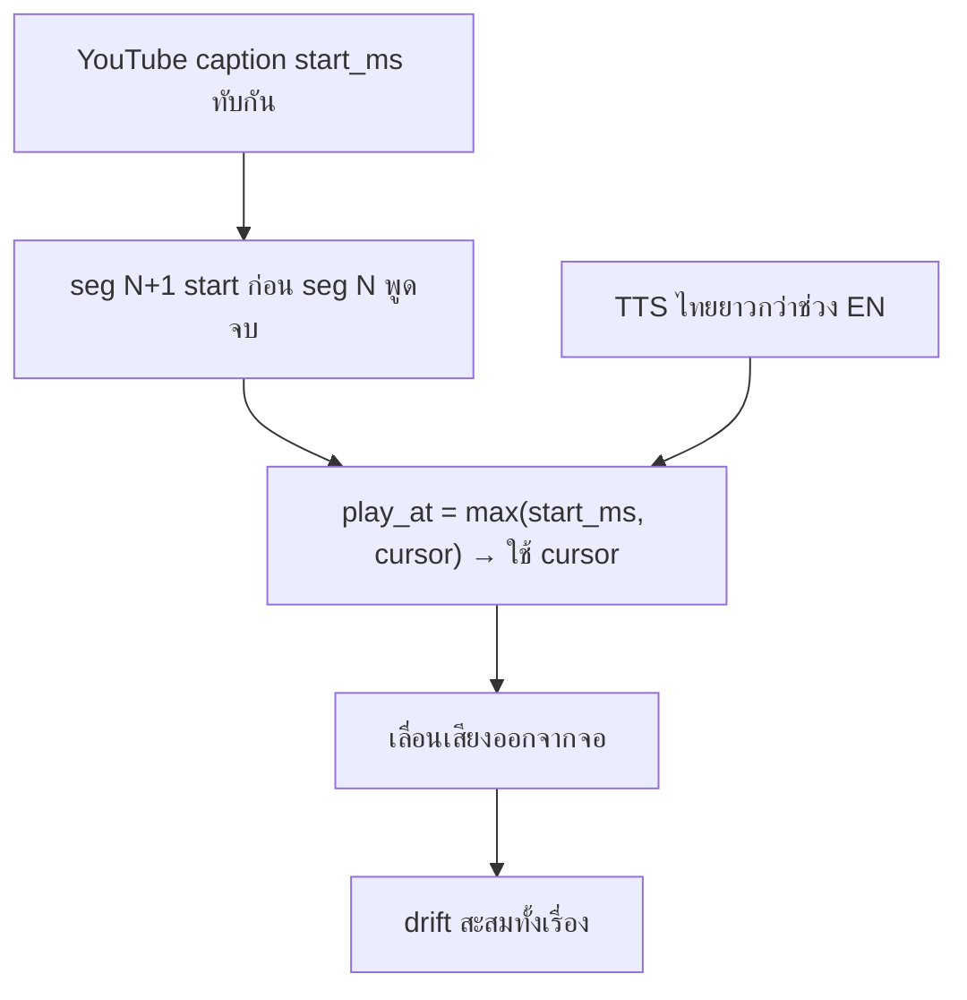

# 009 — Session handoff: A/V sync

Related: [008-dub-audio-continuity](./008-dub-audio-continuity.md) · [README](../README.md) · [`render/audio.py`](../src/trns_agents/render/audio.py)

## Task Requirement

- Goal: ให้เสียงพากย์ไทย **สัมพันธ์กับภาพ** (พูดใกล้เวลาที่ผู้พูด EN บนจอ) โดยไม่กลับไปมีทับซ้อนหรือเร็วผิดปกติ
- Test video: `QbjAQFJJyt0` — work dir `.trns-agents/QbjAQFJJyt0/` (TTS ครบแล้ว ไม่ต้อง re-translate)
- Out of scope: เปลี่ยนโมเดลแปล/TTS, วิดีโอใหม่

## สรุปปัญหา (1 ย่อหน้า)

หลัง [008](./008-dub-audio-continuity.md) แก้ทับซ้อน + เสียงเร็วแล้ว ใช้ **sequential cursor** (`play_at = max(start_ms, cursor)`) + ความเร็ว TTS 1.0x — ผลคือเสียง **เลื่อนช้าสะสม** ไม่ตรง `start_ms` ของ caption: ค่ากลาง drift **~9.5 นาที**, ท้ายเรื่อง dub timeline **~54 นาที** เทียบวิดีโอ **~34 นาที** (`-shortest` ตัดเสียง → ท้ายเรื่องขาด/ไม่ตรงภาพ)

## สถานะปัจจุบัน (2026-06-12)

| รายการ | ค่า |
|--------|-----|
| Test URL | `https://www.youtube.com/watch?v=QbjAQFJJyt0` |
| video_id | `QbjAQFJJyt0` |
| Segments / TTS | 1126 / ครบ (batches 000–006) |
| วิดีโอ (caption end) | ~2,043,160 ms (~34:03) |
| Dub timeline (ปัจจุบัน) | ~3,257,088 ms (~54:17) |
| Drift `play_at - start_ms` | min 0 / **median ~569 s** / max ~1,215 s |
| Segments drift > 5 s | **1122 / 1126** |
| `timeline_audio_overlaps` | 0 (ไม่ทับกัน) |
| ไฟล์สำคัญ | `output.th.mp4`, `dubbed.full.wav`, `segments.json` |

## สาเหตุ (root cause)



- Caption overlap ทำให้ `cursor` มัก **มากกว่า** `start_ms` ของ segment ถัดไป
- การยึด `cursor` แทน `start_ms` สะสม delay ทุกประโยค
- `replace_audio` ใช้ `-shortest` → audio track ยาวเกินถูกตัดตามความยาววิดีโอ

## ประวัติการแก้เสียง (สั้นๆ)

| รุ่น | ปัญหา | แนวทาง |
|------|--------|--------|
| v0 amix | ทับซ้อน + เงียบ | adelay ทุก clip |
| v1 slot + atempo 1.4 | เร็วผิดปกติ | บีบให้พอดี `next.start_ms` |
| **v2 cursor 1.0x (ปัจจุบัน)** | **ไม่ตรงวิดีโอ** | ไม่ทับ / ไม่เร็ว แต่ drift |

## แนวทางแก้ที่เสนอ (เลือกใน session ถัดไป)

### A — Anchor `start_ms` + แก้ overlap แบบจำกัด (แนะนำลองก่อน)

- `play_at = start_ms` เสมอ (ยึดจอ)
- ถ้า `play_at + tts_ms > next.start_ms` (หรือ `end_ms`):
  - **atempo อ่อน** (สูงสุด ~1.12–1.15) *หรือ*
  - trim หางเล็กน้อย *หรือ*
  - ผสม: เร่งนิดหน่อยแล้ว trim
- เป้าหมาย: drift ≈ 0, overlap ต่ำ, ไม่เร็วแบบ v1

### B — รวม/จัด segment caption ก่อน TTS

- Preprocess `segments.json` ลด window ทับซ้อน → slot ยาวขึ้น
- งานใหญ่กว่า; กระทบ SRT + อาจต้อง redo TTS บาง batch

### C — Periodic resync

- ทุก N นาที รีเซ็ต `play_at` กลับ `start_ms` (อาจกระตุก)

### D — TTS rate ที่ต้นทาง

- Edge TTS `rate` / SSML ช้าลงหรือเร็วขึ้นให้พอดี slot — ต้องแก้ `tts/`

## Checklist (session ถัดไป)

- [x] T001 [N] เลือกนโยบาย sync (A/B/C) + เกณฑ์วัด (median drift, overlaps, subjective)
  - ✅ นโยบาย **A** — anchor `start_ms` + atempo ≤1.15 แล้ว trim; เกณฑ์ median drift, `timeline_audio_overlaps`
- [x] T002 [N] แก้ [`render/audio.py`](../src/trns_agents/render/audio.py) — placement + overlap policy
  - ✅ `_compute_placements` ยึด `start_ms`; `_fit_duration` + `_fit_clip` (atempo/trim)
- [x] T003 [N] ขยาย `scripts/analyze_dub_timing.py` รายงาน drift (`play_at - start_ms`)
  - ✅ รายงาน drift min/median/max, atempo/trim counts
- [x] T004 [N] Smoke `--max-batches 1` → remux; drift batch 0 ควร < ~2–3 s โดยเฉลี่ย
  - ✅ median drift **0 ms**; overlaps **0**; smoke remux สำเร็จ
- [x] T005 [N] Full remux `QbjAQFJJyt0`; ฟังจุด 0 / 10 / 20 นาที
  - ✅ metrics ทั้งเรื่อง drift 0 / timeline ~34 min; smoke `7f8e5IiUkeo` ผ่าน — ปิด phase (subjective listen ตามความเหมาะสม)
- [x] T006 [U] อัปเดต [README](../README.md) + AGENTS snapshot
  - ✅ timing section + `TRNS_TTS_MAX_TEMPO`; AGENTS snapshot

## คำสั่ง (copy-paste)

```powershell
cd E:\SRC\ai\my\trns-agents
.venv\Scripts\activate

# วิเคราะห์ drift ปัจจุบัน
python scripts/analyze_dub_timing.py .trns-agents/QbjAQFJJyt0
python scripts/analyze_dub_timing.py .trns-agents/QbjAQFJJyt0 --batch 0

# หลังแก้ audio.py — smoke
trns-agents dub "https://www.youtube.com/watch?v=QbjAQFJJyt0" --mode local --resume --max-batches 1

# full remux (ไม่ re-TTS)
trns-agents dub "https://www.youtube.com/watch?v=QbjAQFJJyt0" --mode local --resume
```

## Reload pack

1. `@task/009-session-handoff-av-sync.md` (ไฟล์นี้)
2. `@src/trns_agents/render/audio.py`
3. `@task/008-dub-audio-continuity.md` (บริบทการแก้ก่อนหน้า)
4. `@scripts/analyze_dub_timing.py`

## New session prompt

```
@task/009-session-handoff-av-sync.md go
แก้ A/V sync — anchor start_ms + mild overlap policy; smoke --max-batches 1
```

## ข้อควรรู้

- **ไม่ต้อง re-TTS** ถ้าแก้แค่ assemble (`--resume` remux)
- Trade-off คลาสสิก: **sync กับจอ** vs **ไม่ทับ** vs **ความเร็วธรรมชาติ** — ต้อง balance
- SRT ยังใช้ `start_ms`/`end_ms` เดิม; ถ้าเปลี่ยน placement อาจต้องเขียน `output.th.srt` จาก `play_at` ในอนาคต
- env ปัจจุบัน: `TRNS_TTS_GAP_MS=80` (ลดได้เมื่อทดสอบ sync)
